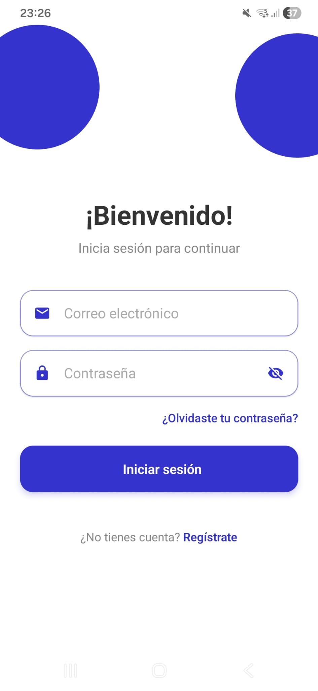
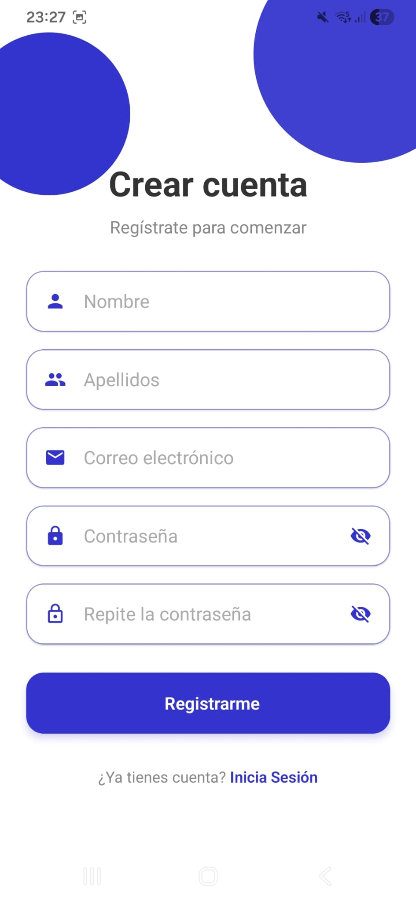
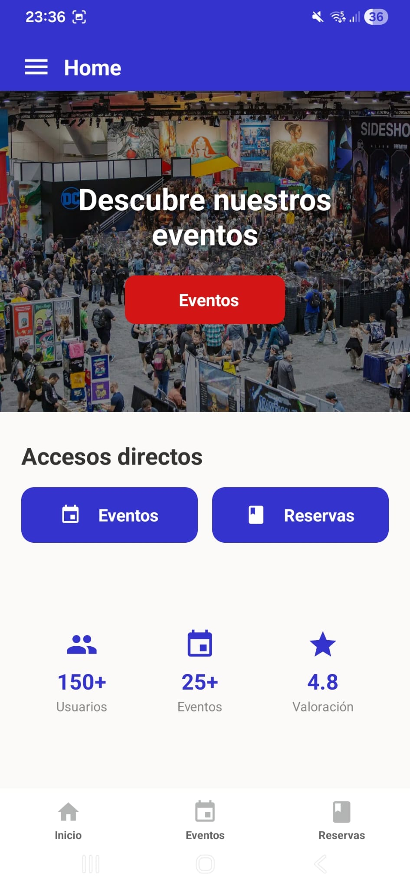
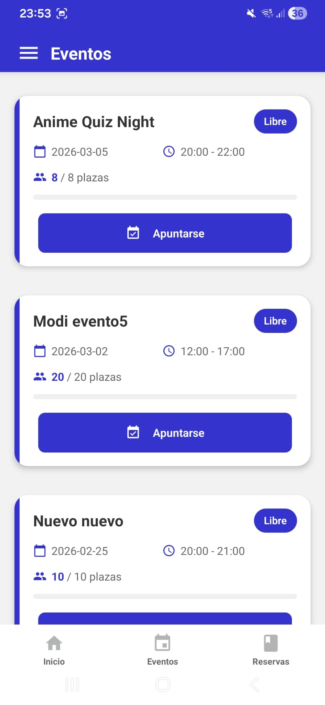
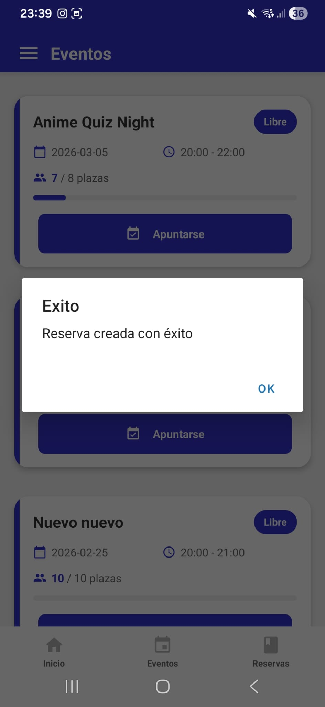
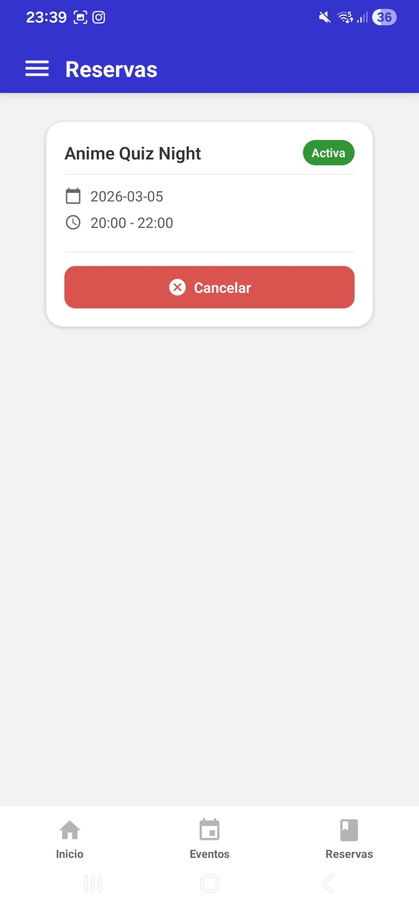
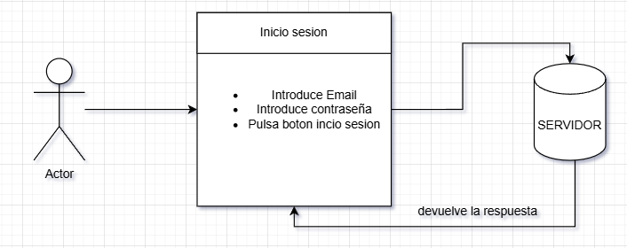
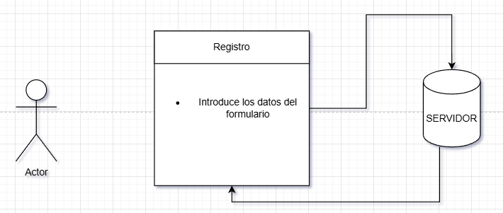
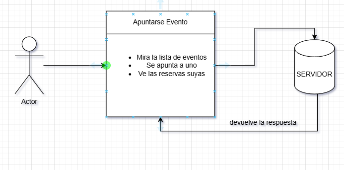

# Introducion

En esta aplicacion de expo en react native creamos una app en donde el usuario pueda apuntarse a un evento, para ello tendra que logearse o registrarse si no esta, una vez dentro de la aplicacion puede ver los eventos que estan en ella Y apuntarse en el eso genera un reserva de ese evento y el usuario podra verla y cancelarla si quiere.

Los eventos pueden ser de lo que queramos un poco ene genral de lo que sea.

## Tecnologias

Para esta parte indicate las tecnologias usadas para la realizacion del mismo:

- React-native :  Framework para crear apps nativas (iOS/Android) con JavaScript
- Expo: conjunto de herramientas y servicios construido sobre React Native que facilita y acelera el desarrollo.
- Material Icons para iconos
- Expo-Router para redirigir
- MongoDb como base de datos
- Axios para conectarme a la Api
- Bcryptjs: Librería para hashear y verificar contraseñas con Node.js

## Vista aplicacion

Vista de login

Vista de registro

### Home usuario
Vista del home de usuario

Ver los eventos que hay.

Apuntarse a un evento.

Reserva del evento.

Cancelar reserva.

Diagramas caso Uso:

### Conclusiones (y lloros)

A lo largo del proyecto tuve muchos problemas como la hora de estructurar o empezar con las tecnologias nuevas que no era solo etse proyecto de react native si no su primo cercano el de vue mas electron, empece por el de vue y electron y fueron bastantes batacazos al principio ya que no me entara ba como crearlo e integrarlo y tuve que recurrrir a ayuda de un ccompañero de clase que me explico un poco y que le dijese a ia que me explicase como un dummie y todo lo que me daba dando para se utiliza esta cosas para que y por que, y poco a poco sacando. Al pricipio fui creando la api y probando sus endpoint con un programa llamado Bruno que es un parecido a postma pero en este no te requiere tener una cuenta y puedes almacenar los endpoint es un carpeta en tu dispositivo y si en mi caso que lo hacia tanto en casa como en clase ayudaba, fui haciendo poco el proyecyo, como que que campos necesarios para el proyecto para crear, como organizar la base de datos etc etc y muchos problemas que perdi mucho tiempo intentado averiguar el por que como por ejemplo el crear un ednpoint dentro de otro endpoint, en el cual cuando intentava probarlo me decia que no lo encontraba y me rallaba diciendo: PERO SI ESTA AHI!!! EXISTE!! asta que depues de varios intentos por mi cuenta y rendirme se lo pase a nuestro pprimo y lo primero que me dijo fue que lo habia creado dentro de otro endpoint, lo movi fuera y ... lo encontro, lo probe y efectivamnete me dio error, pero otro, un nombre del campo mal pero luego ya fue.

Al final el proyecto de vue y electro no salio tan bien como esperaba a la hora de bueo un poco de todo estuctura de proyecto y componetizar x partes y que no, y alguno funcionalidad no termino saliendo a la luz. La del movil en un princio se haria en flutter pero como era tecnologia nueva, y debido tambien al tiempo de entregas se recurrio a react native que ya se trabajo anteriormente en un tres en raya. En este ya me fue mejor por que me paraba con calma(o intento de ella) y poco hacer, conectar a la pi con axios cosa en un principio daba error por que no reconoce localhost que era donde la tenia por que pilla el propio emulador y se tenia que poner hardcodeada la ip de tu maquina eso lo que investigue al principio luego pregunte por opciones y me recomandaron(nuestro primo) una libreria para ello pero ni mire ni supe si funcioanaba y lo deje y quedo asi. 

Luego una vez conectado y todo se crearon varios archivos en donde meter las funcionalidades o llamadas a la api separadas por ejemplo en lo que respecta al login y registro un archivo lo eventos en una y reservas en otras, luego un registro y login para probar y redirigir con router pusch, luego empezar a crear componete como por ejemplo u header que se pasaria el titulo y boton de accion para mostrar el sidebar que es otro componente que se reutiliza en todas las vista, crear un hook en donde tengo el usuario que inicia sesion y lo importo en donde quiero si necesito un dato del, las targetas por ejemplo la estructura del diseño de las targetas de eventos etc etc, ver como es el flujo de los datos, en plan por ejemplo en apuntarse, tengo un boton en la atargtea hafo funcion que llama asl pulsar, recoge los datos, esa funcion llama a otra funcion de la parte de reserva que se concetara a la api y llamara a ese endpoint que crear la reserva y mandara una respuesta que se recogera y cosas del estilo.

Tambien cuando queria hacer un footer o barra de navegacion de movil inferior(no se como se llama, pero como un header pero abajo) se usarian tabs pero no entindi muy bien ese momento y lod eje a apartado y se creo un componete footer con rouer expo ynavega entre las paginas aunque no serian tabs peor nuevo. 

Creo que esto es todo en principio la verdad react native no me desagrado y esta mejor intentar trabajar con componente y saber cuando hacerlos y eso,bueno que me voy por la ramas, al final se saco lo que pudo y tuve batantes errores con las fecha y todo eso, debido a como lo estructure , cuando se me crean eventos un dia ntes por UTC y yo estando UTC +1 y cosas del estilo y errores bastantes por mi parte. Al final quitando los momentos que queria romper cosas por que no me iban x o y o fallos de react native cuando no actualiza y cosas  asi no estuvo tan mal.

